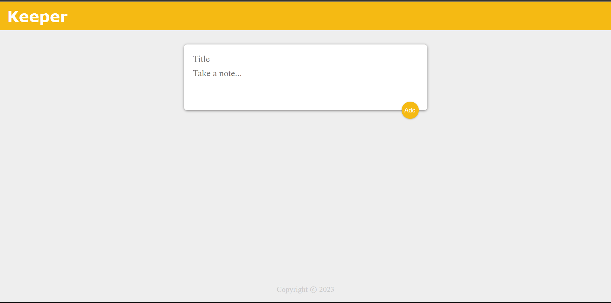

# Keepit - Simple React Note-Taking App

Keepit is a minimalist React application designed for easy note-taking. It provides a user-friendly interface to add, view, and delete notes effortlessly.



## Features

- **Create Notes:** Add new notes with a title and content.
- **View Notes:** Easily view a list of existing notes.
- **Delete Notes:** Remove unwanted notes with a single click.

## Installation

1. **Clone the Repository:**

   ```bash
   git clone https://github.com/kamalkansal27/keepit.git
   cd keepit
